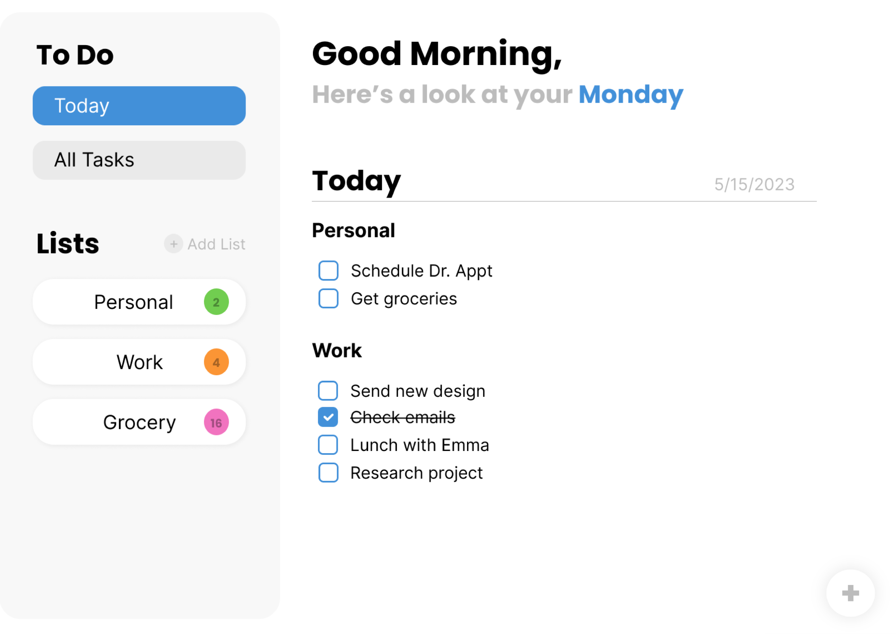

# To Do List

A minimal, user-friendly to do list application that presents your daily tasks up front. Seamlessly transition to a comprehensive list view, add new tasks and delete old ones, or move tasks to different lists. Created to practice OOP and ES6 module syntax.

:arrow_right: [Live Preview](https://paigebraun.github.io/todo-list/)

## Screenshots

## Features

- Daily task viewer
- List view with color coordinated lists
- Add, update, and delete tasks and lists

## Tech Stack

HTML, CSS, Javascript, Webpack